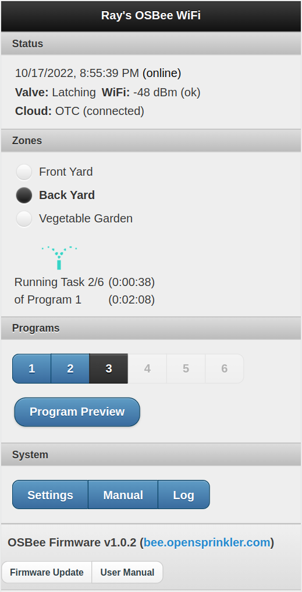
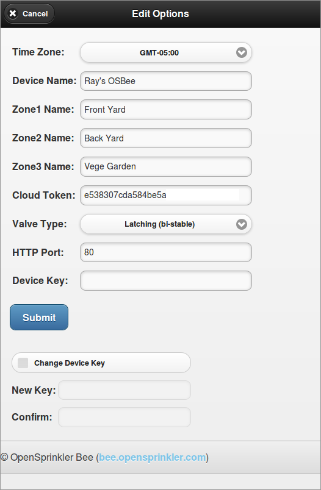
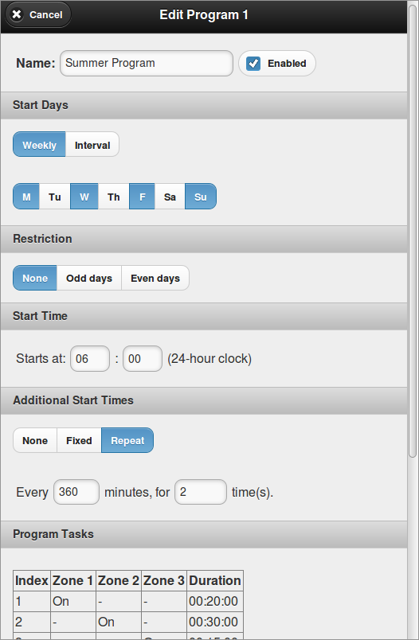
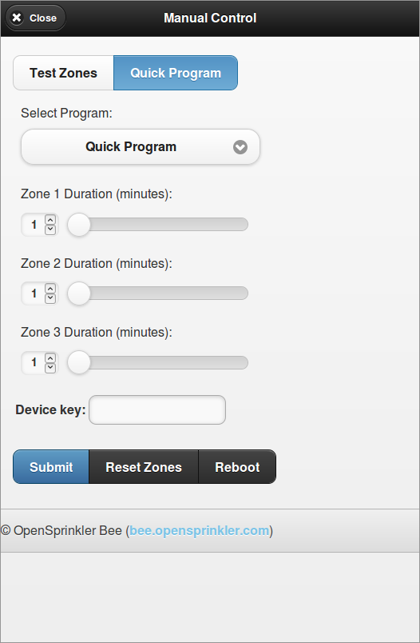
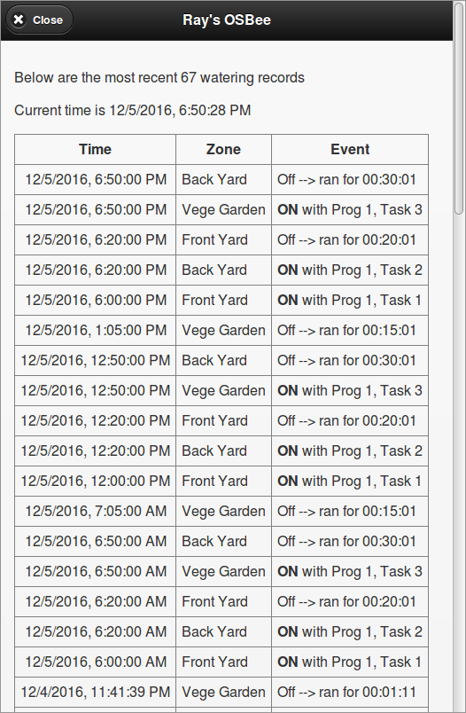
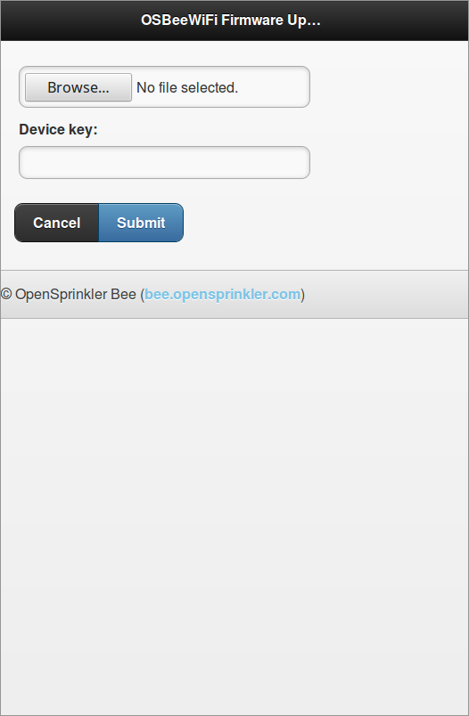
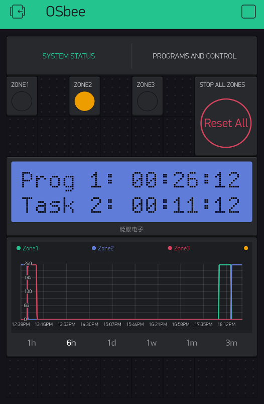
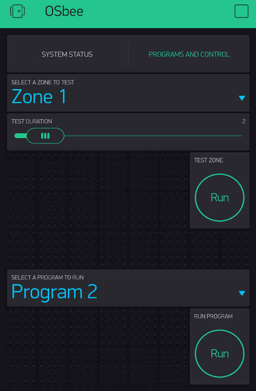

This folder contains the OpenSprinkler Bee WiFi (OSBeeWiFi) firmware code for Arduino with ESP8266 core. Below are some screen shots of the user interface. For details, visit [http://bee.opensprinkler.com](http://bee.opensprinkler.com)

        

Updates:
=======
* (10/17/2022) Firmware 1.0.2 for OSBeeWiFi (support for both Blynk and OTC)
* (02/09/2021) Update firmware for OSBeeWiFi version 3.0
* (12/05/2016) Release first version of OSBeeWiFi firmware

Preparation:
===========

* Install makeEspArduino (Method 1 below), or Arduino 1.6.x with ESP8266 core (Method 2 below)
* ESP8266 core for Arduino v2.7.4 (https://github.com/esp8266/Arduino/releases/tag/2.7.4)
* Blynk library for Arduino v1.0.1 (https://github.com/blynkkk/blynk-library/releases/tag/v1.0.1) 
* SSD1306 library v4.2.1 (https://github.com/ThingPulse/esp8266-oled-ssd1306/releases/tag/4.2.1) 
* OpenThingsFramework library ()https://github.com/OpenThingsIO/OpenThings-Framework-Firmware-Library)
* WebSocket library v2.3.5 (https://github.com/Links2004/arduinoWebSockets/releases/tag/2.3.5)
* This (OSBeeWiFi) source code

Compilation:
===========

#### Method 1: use makeEspArduino

If you are familiar with Makefile, I highly recommend you to use makeEspArduino:

https://github.com/plerup/makeEspArduino

Follow the instructions to install ESP8266 core files. Then download or git clone the libraries listed above to the 'libraries' subfolder in your home folder's Arduino directory. The OSBeeWiFi source files has an example Makefile which you can modify to match your specific ESP8266 path.

To compile the code, simply run 'make' in the OSBeeWiFi folder to compile the programs. The compiled firmware (named osbeeArduino.cpp.bin) by default exists in a temporary folder.

#### Method 2: use Arduino IDE

Go to http://arduino.cc to download and install the Arduino software. Then follow the instructions at:

https://github.com/esp8266/Arduino

to install the ESP8266 core 2.7.4 for Arduino. Next, install the libraries listed above in Arduino's.

To compile, launch Arduino, select:

* File -> Examples -> OSBeeWiFi -> osbeeMain.
* Tools -> Board -> Generic ESP8266 Module (if this is not available, check if you've installed the ESP8266 core).
* Tools -> Flash Size -> 4M (2M SPIFFS).

Press Ctrl + R to compile. The compiled firmware (named osbeeMain.cpp.bin) by default exists in a temporary folder.

Upload Firmware:
=========

As OSBeeWiFi firmware supports OTA (over-the-air) update, it's highly recommended that you upload the firmware through the web interface.

If OTA updates fails, you can still upload the firmware through USB instead. To do so:

* First, install CH340 driver:
  - Mac OSX: install the driver from http://raysfiles.com/drivers/ch341ser_mac.zip
  - Linux: (dirver is not needed, make sure you run Arduino as root, or add 1a86:7523 to udev rules).
  - Windows: driver is only needed for Win 7 64-bit or Win XP (http://raysfiles.com./drivers/ch341ser.exe)

* Let OSBeeWiFi enter bootloading mode. Specifically:
  - Unplug the USB cable
  - Press and hold the pushbutton on OSBeeWiFi while plugging in the USB cable
  - Release the pushbutton (the LED should stay on)
  The LCD screen should remain off. If the LCD screen lights up, it has failed to enter bootloading mode. Just repeated the procedure. Every time you upload a new firmware through USB, you need to let it enter bootloading mode first.

* If you have compiled the firmware using the makeEspArduino method, you can use the Makefile to upload firmware. First, check the USB serial port name:
  - Mac OSX: the port name is typically /dev/tty.wchusbserial####. You can run 'ls /dev/tty.wch*' to find out.
  - Linux: the port name is typically /dev/ttyUSB#. You can run 'ls /dev/ttyUSB*' to find out.
Next, modify the Makefile to change the serial port name to match yours. Then run 'make upload' in the OSBeeWiFi folder. 

* If you have compiled In Arduino, press Ctrl + U to start uploading.

Firmware Features:
=================

The firmware supports a built-in web interface (which you can access using the device's local IP) as well as remote access using either Blynk legacy app, or OpenThingsCloud (OTC) connection.

* Initial Connection to WiFi:

On first boot-up, the firmware starts in AP mode, creating a WiFi network named OSB_XXXXXX where XXXXXX is the last six digits of the MAC address. This is an open AP with no password. The LCD displays the AP name and a dot blinks quickly at about twice per second. Using your phone or computer to connect to this AP, then open a browser and type in

192.168.4.1

to access the AP homepage. If you use Android phone, it may warn you about 'No Internet Connection'. Simply click the checkbox to confirm.

Select (or manually type in) the desired SSID, password, and (optionally) Blynk's authorization token (refer to the instructions above). If you don't want to input the Blynk token, you can leave it empty for now. Then click 'Submit'. Wait for 15 to 30 seconds for the device to connect to your router. If successful, it will display the local IP address with further instructions.

* For details of the other firmware features, please check the User Manual in the docs folder.

Update Firmware:
===============

The current firmware version is displayed at the homepage. When a new firmware becomes available, you can click on the 'Update' button on the homepage to upload a new firmware.

If the update ever fails, power cycle (unplug power and plug back power) the device and try again. If it still doesn't work, you can update firmware through the USB port (see instructions above).

Notes about Modifying Firmware:
===============
You can change the firmware code to add new features and follow the instructions above to compile and upload. Note that the built-in user interface embeds HTML files to the firmware source code. To modify the HTML files (so that you can change how the webpages are rendered), go to the html/ subfolder, which contains the original HTML files. Make any changes necessary, and use the html2raw tool to convert these HTML files into program memory strings (which are saved in htmls.h). Every time you make changes to the HTML files, you must re-run html2raw in the html folder to re-generate the program memory strings.
